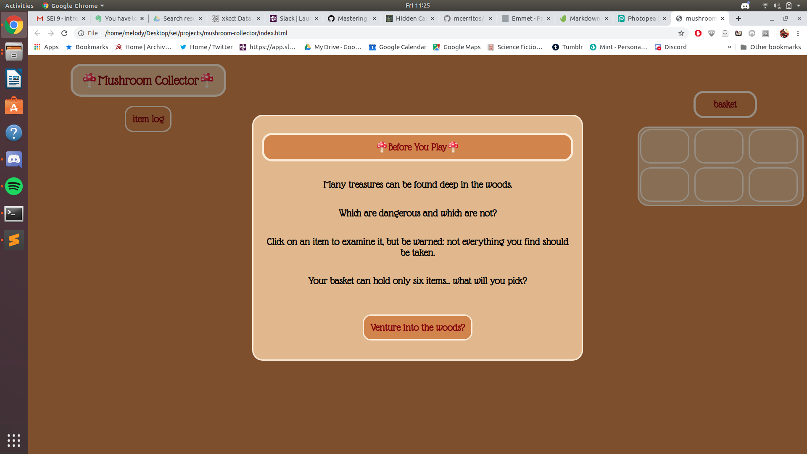
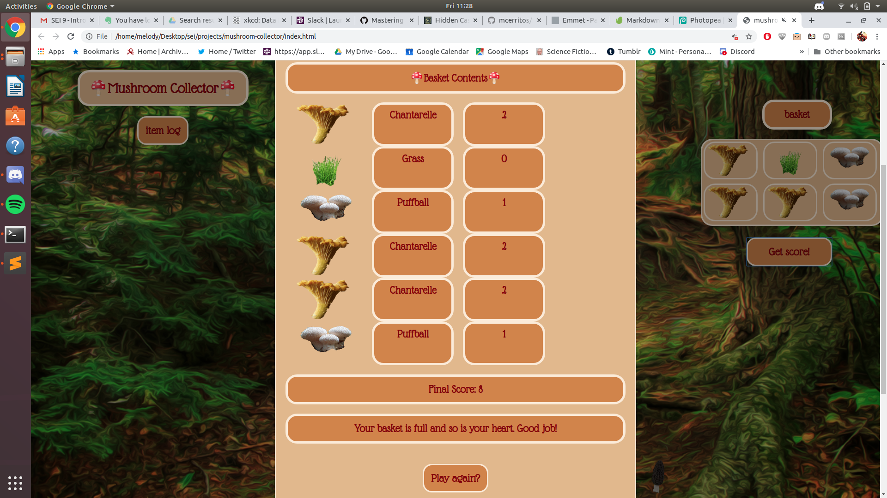

# mushroom-collector

### A game where the user collects mushrooms and other items from the forest floor. Users can inspect items, place them in the basket, and submit them for a score. Each round of the game the user add another item to their logbook, allowing them to see whether a mushroom is poisonous or not. 

### All mushrooms depicted are real. 

### This game constructed with help from the w3 schools modal tutorial. 

