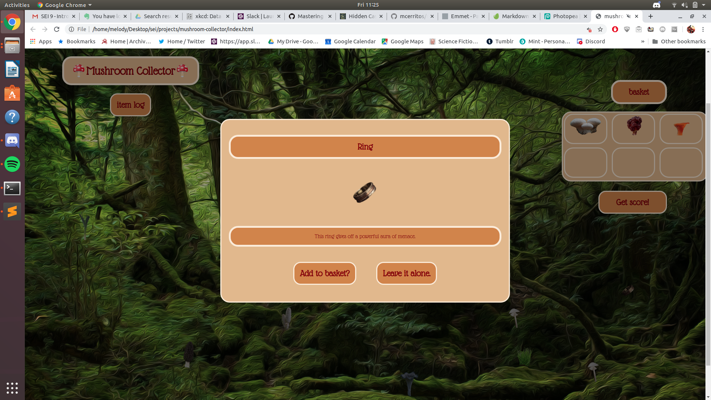

### Mushroom Collector
Mushroom Collector is a browser game designed to take the user through a variety of interesting backgrounds in search of items to put into their basket. Users can inspect items, place them in the basket, and submit them for a score. Each round of the game the user adds another item to their logbook, allowing them to see whether a mushroom is poisonous or not.

Mushroom Collector was built using HTML, CSS, Javascript, Node, Express, and MongoDB. 
 
### Data Models:
  Mushroom ⟷ User 
	Mushroom - name, description, point value
	User: username, password, basket [referenced mushroom data, max 6], log [referenced mushroom data], high score
  
### Milestones: 
  Sprint 1 - create wireframe, user stories, data models and delegation done to present the project for approval. Create mushroom images and research mushrooms to accurately describe them
  Sprint 2 - design and implement css for displaying mushrooms at random across the forest floor, design basket functionality and “more information” modals and implement passing data between them
  Sprint 4 - Set up server, database, and models 
  Sprint 5 - set up api calls to store current basket, log, and allow user signup
  
### Final Product:

